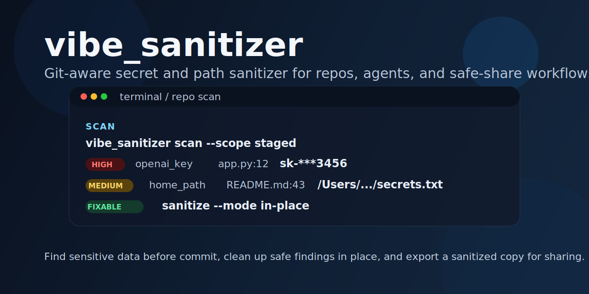

# vibe_sanitizer



`vibe-sanitizer` is a Git-aware CLI for finding and redacting sensitive content in repositories before you commit, share, or publish them. 

It is designed for AI-assisted and vibe-coded repositories, which often contain secrets, local file paths, and machine-specific details that should not leave your laptop.

It also supports agent-driven workflows through skills, so tools such as Codex, Claude Code, and similar coding agents can use it consistently and safely.


## Why

Most secret scanners are strongest in CI or after code is already committed. `vibe-sanitizer` focuses on the local repository step:

- scan the files you are about to commit
- clean up safe findings in place
- export a separate sanitized copy for sharing
- avoid leaking raw secret values in reports

## Features

- Git-aware scan scopes: `working-tree`, `staged`, `tracked`, and `commit`
- Safe in-place cleanup for pre-commit workflows
- Separate `export` command for a sanitized shareable copy
- Human-readable and JSON scan output
- Config file support through `.vibe-sanitizer.yml`
- Bundled skill guidance for agent-driven workflows
- Extensible detector module layout for adding new rules later

## Install

Local development:

```bash
cd vibe-sanitizer
pip install .
vibe_sanitizer --help
```

The project currently uses the Python standard library only.

## Quick Start

Scan files in the working tree:

```bash
vibe_sanitizer scan --scope working-tree
```

Scan staged files before commit:

```bash
vibe_sanitizer scan --scope staged
```

Apply safe in-place cleanup:

```bash
vibe_sanitizer sanitize --scope staged --mode in-place
```

Export a sanitized copy for sharing:

```bash
vibe_sanitizer export --scope tracked --output ../safe-share
```

Create a starter config:

```bash
vibe_sanitizer init-config
```

## Agent Support

`vibe-sanitizer` is designed to work well with coding agents and agent-assisted developer tools.

Supported workflow style:

- Codex and Codex-style terminal agents
- Claude Code style repo workflows
- other agents that can run local CLI commands before commit or before sharing a repo

The repository includes a bundled skill at [`skills/vibe-sanitizer/SKILL.md`](skills/vibe-sanitizer/SKILL.md). It teaches an agent to:

- choose the right Git-aware scan scope
- report findings without exposing raw secret values
- use `sanitize --mode in-place` for safe pre-commit cleanup
- use `export` when the goal is a shareable sanitized copy

Recommended agent workflow:

1. Run `vibe_sanitizer scan --scope working-tree` while iterating locally.
2. Run `vibe_sanitizer scan --scope staged` before commit.
3. Run `vibe_sanitizer sanitize --scope staged --mode in-place` for safe rewrites.
4. Run `vibe_sanitizer export --scope tracked --output ../safe-share` when creating a public-safe copy.

Example prompts for agents:

```text
Run vibe_sanitizer scan --scope staged and summarize the findings without printing raw secrets.
```

```text
Use the vibe-sanitizer skill and make this repository safe to share. Fix only findings that are safe in place, then tell me what still needs manual review.
```

## Commands

### `scan`

Reports findings without modifying files.

Text output uses color by default when writing to a TTY:

- `critical` and `high`: red
- `medium`: yellow
- `low`: blue
- fixable findings: green tag
- review-required findings: yellow tag

Use `--color auto|always|never` to control ANSI color output explicitly.

Examples:

```bash
vibe_sanitizer scan --scope working-tree
vibe_sanitizer scan --scope staged --color always
vibe_sanitizer scan --scope tracked --format json
vibe_sanitizer scan --scope commit --commit <sha>
```

### `sanitize`

Applies only the findings that are considered safe to rewrite in the original repository.

Examples:

```bash
vibe_sanitizer sanitize --scope working-tree --mode in-place
vibe_sanitizer sanitize --scope staged --mode stdout
```

### `export`

Creates a separate sanitized copy outside the source repository. This is the right workflow when you want a public-safe or contractor-safe copy.

Examples:

```bash
vibe_sanitizer export --scope tracked --output ../safe-share
vibe_sanitizer export --scope tracked --output ../safe-share --init-git
```

### `init-config`

Writes a starter `.vibe-sanitizer.yml` file.

## Scan Scopes

- `working-tree`: tracked files plus untracked files that are not ignored by `.gitignore`
- `tracked`: files already tracked by Git
- `staged`: files currently staged in the index
- `commit`: files changed in a specific commit

## Detection Coverage

Built-in detectors currently flag:

- PEM-style private key blocks
- OpenAI-style keys such as `sk-...`
- AWS access key ids such as `AKIA...` and `ASIA...`
- GitHub tokens such as `ghp_...` and `github_pat_...`
- Slack tokens such as `xoxb-...`
- bearer tokens
- URLs with embedded credentials
- quoted secret-like assignments such as `api_key = "..."` or `password = "..."`
- absolute workspace paths
- home-directory paths on Unix-like systems
- temporary directory paths
- Windows user-directory paths

## Edit Behavior

### Auto-edited by `sanitize --mode in-place`

- private key blocks
- OpenAI keys
- AWS access key ids
- GitHub tokens
- Slack tokens
- bearer tokens
- workspace paths
- home-directory paths
- temporary directory paths
- Windows user-directory paths

### Flagged for review, not auto-edited in place

- credential-bearing URLs
- generic quoted secret assignments

These findings are still redacted in `export`, but they are not rewritten in place by default because they may change application behavior.

## Output and Exit Codes

`scan` exits with:

- `0` when no findings are present
- `1` when findings are detected
- `2` on command or repository errors

Reports never print full secret values. Findings include masked previews only.

JSON output is never colorized.

## Configuration

Create `.vibe-sanitizer.yml` in the repository root to customize behavior.

Supported keys:

- `ignore_detectors`
- `path_exclusions`
- `allow_patterns`
- `severity_overrides`
- `placeholders`

Starter config:

```yaml
ignore_detectors: []
path_exclusions: []
allow_patterns: []
severity_overrides: {}
placeholders:
  openai_key: "<REDACTED_OPENAI_KEY>"
```

## Project Status

`vibe-sanitizer` is usable today as a local CLI and is still evolving.

Current implementation includes:

- modular detector registry
- Git-aware scope resolution
- in-place sanitize workflow
- export workflow with optional fresh Git init
- unit and workflow tests

See [docs/PLAN.md](docs/PLAN.md) for the public roadmap for project direction.

## Contributing

Contributions are welcome. See [CONTRIBUTING.md](CONTRIBUTING.md).

## Security

If you discover a detector bypass or an unsafe redaction path, see [SECURITY.md](SECURITY.md).

## License

MIT. See [LICENSE](LICENSE).
